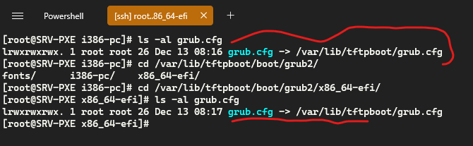

# PXE 2.0 With Proxy DHCP

- By : Greydark
- Date : December 13, 2022
- Tag : Sysadmin

# Requirements

> Here are the list of requirements
> 
1. Linux OS such as  AlmaLinux
2. Server TFTP
3. Server DHCP Proxy
4. Server HTTP 

# Installing

### ***Grub packages***

```bash
dnf install grub2-efi-x64-modules grub2-tools-extra -y
```


### ***Grub2-mknetdir***

```bash
grub2-mknetdir --net-directory /var/lib/tftpboot/
```


# DHCP Proxy

### ***Dnsmasq ( Because It is  All in one Service,  It contains  : TFTP DHCP DNS)***

```bash
dnf install dnsmasq -y
```

### ***I Disable Firewalld  ( Because It blocks some services I need)***

```bash
# Note: To Disable 
systemctl stop firewalld
systemctl disable firewalld

# To enable again 
systemctl enable firewalld
systemctl start firewalld

```

### ***Backup Dnsmasq.Conf***

```bash
[root@SRV-PXE ~]# mv /etc/dnsmasq.conf /etc/dnsmasq.conf.bak
```

### ***Edit Dnsmasq.Conf***

```bash
[root@SRV-PXE ~]# nano /etc/dnsmasq.conf
```

```bash
# Doesn't work  as a DNS server:
port=0

# Logs lots of extra information about DHCP transactions.
log-dhcp

# Sets the root directory for files available via TFTP.
enable-tftp
tftp-root=/var/lib/tftpboot/

# The boot filename, Server name, Server Ip Address
dhcp-boot=boot/grub2/x86_64-efi/core,,192.168.1.160

# Disables re-use of the DHCP servername and filename fields as extra
# option space. That's to avoid confusing some old or broken DHCP clients.
dhcp-no-override

# inspect the vendor class string and match the text to set the tag
dhcp-vendorclass=BIOS,PXEClient:Arch:00000
dhcp-vendorclass=UEFI32,PXEClient:Arch:00006
dhcp-vendorclass=UEFI,PXEClient:Arch:00007
dhcp-vendorclass=UEFI64,PXEClient:Arch:00009

# PXE menu.  The first part is the text displayed to the user.  The second is the timeout, in seconds.
pxe-prompt="Booting PXE SERVER", 1

# The known types are x86PC, PC98, IA64_EFI, Alpha, Arc_x86,
# Intel_Lean_Client, IA32_EFI, BC_EFI, Xscale_EFI and X86-64_EFI
# This option is first and will be the default if there is no input from the user.
pxe-service=X86PC, "Boot to PXE SERVER (BIOS)",boot/grub2/i386-pc/core
pxe-service=X86-64_EFI, "Boot to PXE SERVER (UEFI)",boot/grub2/x86_64-efi/core.efi

dhcp-range=192.168.1.254,proxy
```

### ***Config Grub.cfg (Is Grub menu)***

```bash
touch /var/lib/tftpboot/grub.cfg
```

### ***Let’s Make Symlink like below :***

```bash
ln -sf /var/lib/tftpboot/grub.cfg /var/lib/tftpboot/boot/grub2/i386-pc/grub.cfg
ln -sf /var/lib/tftpboot/grub.cfg /var/lib/tftpboot/boot/grub2/x86_64-efi/grub.cfg

#it is used to restore the default context of a file or directory by reading the default rules set in the SELinux policy.
restorecon -r /var/lib/tftpboot/
```



### ***Configuring our Menu Grub for testing***

```bash
# nano /var/lib/tftpboot/grub.cfg
```

```bash
set default=0
set timeout=60
menuentry 'EFI Firmware System Setup' $menuentry_id_option 'uefi-firmware' {
  fwsetup
}

menuentry 'Reboot' {
  reboot
}

menuentry 'Shutdown' {
  halt
}
```

### ***Overview of the config above***


### ***Now i Will custom my Boot-loader like a boss*** 😎

> ***Preview of a custom grub***
> 


### ***Let’s customize our Grub***

```bash
We can find Various Grub themes on : **https://www.gnome-look.org/browse?cat=109&ord=rating**
```


```bash
# download grub theme you want, In my case i choose "DedSec"

# tar -xf to decompress archive file in  my cqse it is zip  so unzip
unzip legion-1080p.zip

# Make theme Directory 
mkdir /var/lib/tftpboot/boot/grub2/themes 

# copy Tela to /var/lib/tftpboot/boot/grub2/themes
cp -r DedSec /var/lib/tftpboot/boot/grub2/themes
```

### ***Now Change our Grub.cfg***

```bash
# nano /var/lib/tftpboot/grub.cfg
```

```bash
#Grub.cfg
set default=0
set timeout=60
insmod all_video
insmod gfxterm
insmod gfxterm_menu
insmod gfxmenu
insmod gfxterm_background
insmod png
terminal_output gfxterm
#loadfont /boot/grub2/fonts/unicode.pf2
set theme=/boot/grub2/themes/legion/theme.txt
export theme

menuentry "Windows 10 Installer" {
    insmod http
    insmod ntfs
    set root='(http,192.168.1.160)/path/to/installation/files'
    search --set=root --file /bootmgr
    ntldr
    boot
}

menuentry 'Reboot' {
  reboot
}

menuentry 'Shutdown' {
  halt
}
```


# HTTP SERVR

## **SETUP HTTP SERVER**

> [Lighttpd](https://www.lighttpd.net/) is open-source web server software. It’s designed specifically for 
environments with limited resources since it consumes minimal CPU and 
RAM . in our case, is not necessary to install Apache2 or Ngnix just a tiny HTTP Server
> 

```bash
#Let’s start by adding the EPEL repository to the system because that is where the lighttpd package is hosted.

sudo dnf install epel-release -y

#Then, you can install the program by running the following command:

sudo dnf install lighttpd -y
```

- nano /etc/lighttpd/lighttpd.conf  # to changes some config like below
- server.bind = {Your address IP}
- Disable Ipv6 We dont need it , Like :  #server.use-ipv6 = "enable"

```bash

#######################################################################
##
##  Basic Configuration
## ---------------------
##
server.port = 80
##
## Use IPv6?
##
#server.use-ipv6 = "enable"

##
## bind to a specific IP
##
server.bind = "192.168.1.160"
##
```

```bash
#To enable dirlisting
nano /etc/lighttpd/conf.d/dirlisting.conf

# Remove  "#"

dir-listing.activate      = "enable"

# Now To allowing the  HTTP server to set resource limits for itself

$ setsebool -P httpd setrlimit on
```

```bash
#Test If our HTTP server Work

echo "Hello Greydark !" > /var/www/lighttpd/Hello_world.txt
```


# FINISHING

### ***Configuring grub to boot from HTTP SERVR***

```bash
#nano  /var/lib/tftpboot/grub.cfg
# Use menutry like below:

menuentry "Ubuntu 21.04 Live (HTTP)" {
    set iso_path=(http)/images/Ubuntu.iso
    set iso_name=Ubuntu.iso
    loopback loop $iso_path
    set root=(loop)
    linux (loop)/live/vmlinuz iso-scan/filename=$iso_name quiet splash
    initrd (loop)/live/initrd.img
```
